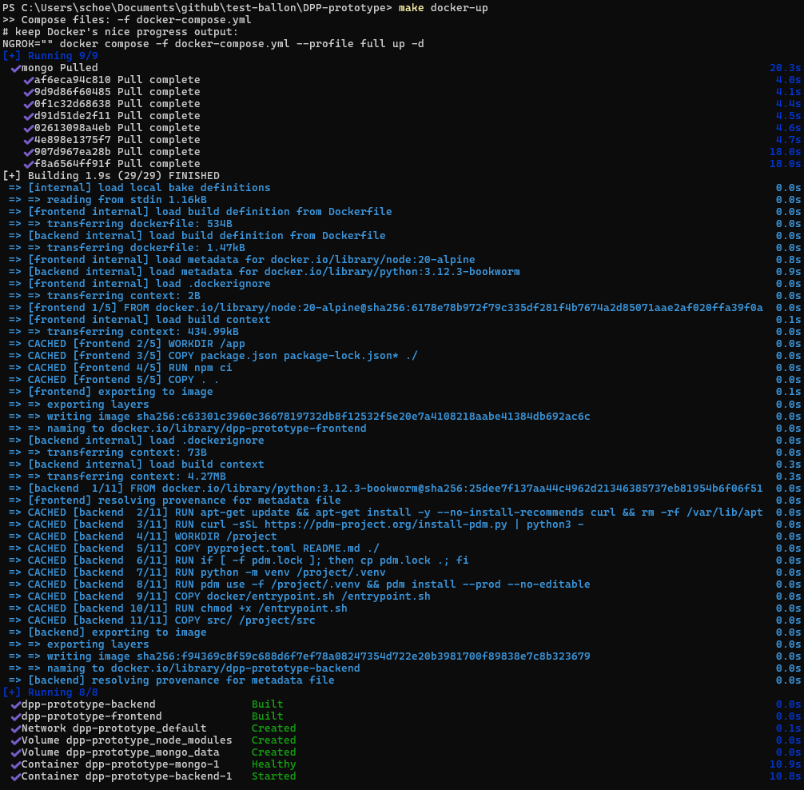
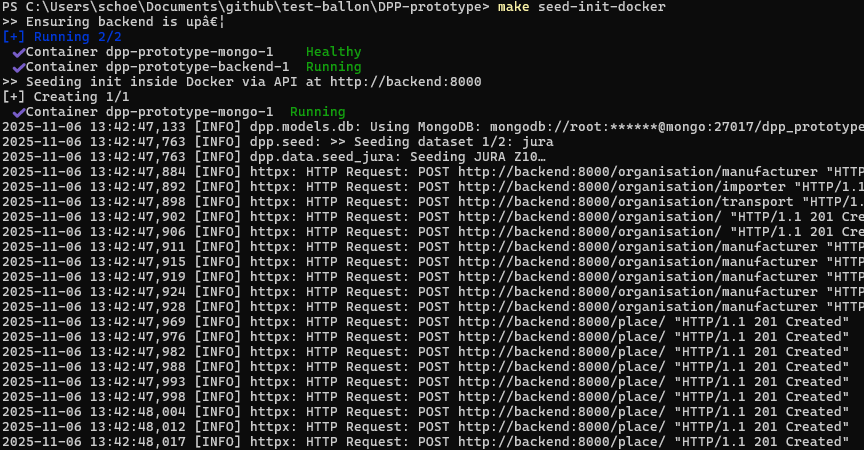
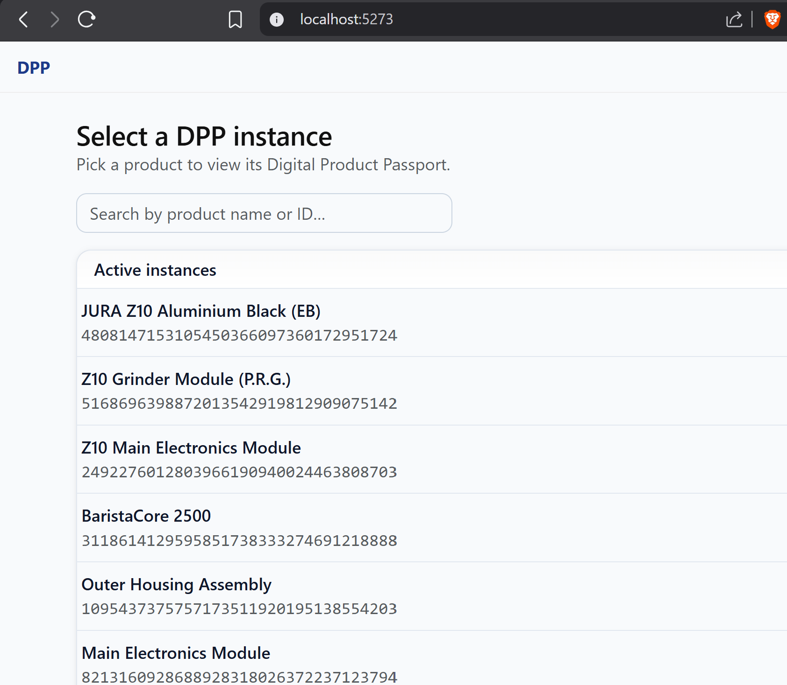
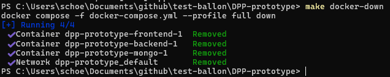
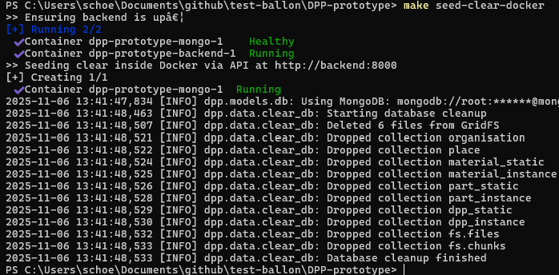
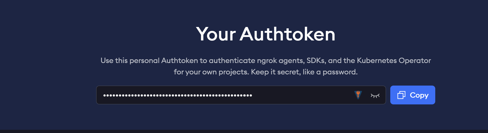
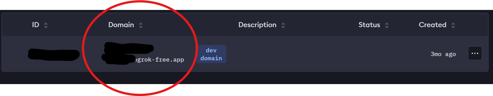

# DPP – Digital Product Passport

A Beanie/FastAPI backend with a Vite/React frontend.
Runs **fully in Docker** (FE+BE+DB).
Hot reload in Docker.

## Prerequisites (must be installed on your machine)

### 1. Docker & Docker Compose

Depending on your OS, install Docker & Docker Compose.
On Linux, you can install Docker Engine and Docker Compose Plugin as per the [official instructions](https://docs.docker.com/engine/install/).
On Windows, use [Docker Desktop](https://www.docker.com/products/docker-desktop/).

### 2. Make

Make is used to provide convenient commands for bringing up/down the Docker setup and seeding data.
On Linux, install via your package manager (e.g. `sudo apt install make`).
On Windows, you can use the one provided by [Git Bash](https://git-scm.com/downloads) or install [GNU Make for Windows](http://gnuwin32.sourceforge.net/packages/make.htm).

### 3. Optional prerequisites

You may want to install ngrok for exposing your local backend to the internet (e.g. for remote demos).
See the [Ngrok / Public Tunnels](#ngrok--public-tunnels) section below for details.

## Start instructions

1. Clone/copy this repo to your local machine
2. Bring everything up (FE+BE+DB)
    In the project root (where this README.md is located), run:

    ```bash
    make docker-up
    ```

    
3. Optional: Seed data (only for first start or when you cleared the database)

    ```bash
    make seed-init-docker
    ```

    
4. Open your browser at [http://localhost:5273](http://localhost:5273) for the frontend access
    
    5. Stop & remove containers when the prototype is no longer needed

    ```bash
    make docker-down
    ```

    

### Seed Data

There is one seed dataset.
One for a real world product [JURA Z10](https://de.jura.com/de/produkte-haushalt/kaffeevollautomaten/z10-aluminium-black-eb-15609/Manuals#tabs--documents).
The three images used are from the [official Spec Sheet](https://us.jura.com/en/homeproducts/machines/Z10-Aluminium-White-NAA-15361/Specifications) (publicly available).
Beside this, there is a fictional product to show more complex process and component hierarchies to demonstrate how a deeper nested product passport can be modeled.
Even though the JURA Z10 is a real product, not all data is publicly available, so the dataset uses publicly available information where available and fills in the gaps with fictional, but plausible model data.
The examples shown are not affiliated with any real-world manufacturer.
They are purely for demonstration purposes.
To seed the database with the example data, run:

```bash
make seed-init-docker
```


To clear the database again:

```bash
make seed-clear-docker
```



## Ngrok / Public Tunnels (optional for remote demos)

In case you want to expose your local backend to the internet (e.g. for a remote demo), you can use [ngrok](https://ngrok.com/) for this.

1. Create a free ngrok account at [https://ngrok.com/](https://ngrok.com/)
2. Get your auth token from the ngrok dashboard [https://dashboard.ngrok.com/get-started/your-authtoken](https://dashboard.ngrok.com/get-started/your-authtoken)

3. Claim your custom subdomain (free plan allows one subdomain under ngrok-free.app, e.g. your-subdomain.ngrok-free.app) at [https://dashboard.ngrok.com/domains](https://dashboard.ngrok.com/domains)

4. Install ngrok on your machine
  On Linux, you can install ngrok via snap:

    ```bash
    sudo snap install ngrok
    ```

    On Windows, download the installer from [https://ngrok.com/download/windows](https://ngrok.com/download/windows) and run it.

5. Configure ngrok with your auth token (once only, copy from step 2):

    ```bash
    ngrok config add-authtoken <your-ngrok-auth-token>
    ```
    
6. Whenever you need it, start an ngrok tunnel to your local backend (you need to keep this running while working with the remote setup). This shall be done in a separate terminal window.

    ```bash
    ngrok http --domain=your-subdomain.ngrok-free.app 5273
    ```

7. Run the Docker setup with the ngrok host:

    ```bash
    # One-time use:
    make docker-up NGROK=your-subdomain.ngrok-free.app
    ```

    Alternatively, you can store the ngrok host in a file named `.ngrok-host` in the project root:

    ```bash
    echo your-subdomain.ngrok-free.app > .ngrok-host
    ```

    When using the alternative method, simply run:

    ```bash
    make docker-up
    ```
8. Access the frontend via the ngrok URL in your browser:
    ```
    https://your-subdomain.ngrok-free.app
    ```

## URLs for dev setup

* Frontend (dev): [http://localhost:5273](http://localhost:5273)
* API base: [http://localhost:8000](http://localhost:8000)
* API docs: [http://localhost:8000/docs](http://localhost:8000/docs)
* API health: [http://localhost:8000/health](http://localhost:8000/health)

## Disclaimer

The images stored in backend/src/dpp/data/images/ are for demonstration purposes only and were generated by ChatGPT by prompting it to create images of a coffee machine or taken from the [official Spec Sheet](https://us.jura.com/en/homeproducts/machines/Z10-Aluminium-White-NAA-15361/Specifications).
They are not intended for commercial use.
As described above, the dataset includes fictional data.
It is purely for demonstration purposes and not affiliated with any real-world manufacturer.
